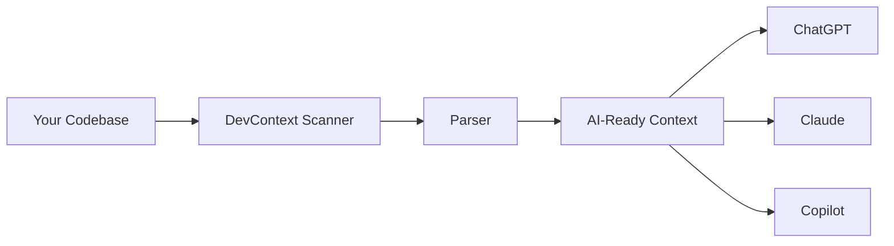

# 🔮 DevContext

[](https://github.com/jhony91792-oss/devcontext)
[](https://github.com/jhony91792-oss/devcontext)
[](https://github.com/jhony91792-oss/devcontext)
[](https://github.com/jhony91792-oss/devcontext/actions)
[](https://python.org)

**Give your AI assistant a 200 IQ boost — feed it your entire codebase in 3 seconds.**

Stop wasting 10-15 minutes every time you start a new AI session explaining your project. DevContext extracts structured, AI-ready context from any codebase so your favorite AI assistant already knows your project cold.

[Install](#installation) · [Quick Start](#quick-start) · [Examples](#examples) · [Documentation](#documentation)

---

## Why DevContext?

Every AI coding assistant fails the same way — **it doesn't know your project**.

```bash
# You before DevContext:
"Here's my codebase, it's a REST API with auth and database..."

# With DevContext:
$ devcontext generate . | pbcopy  # Done. Paste into AI. Instant context.
```

**You lose 10-15 minutes per session** explaining your project to every new AI chat.  
If you use AI assistants 5 times a day, that's **1 hour wasted daily**.  
**DevContext gives that time back.**

---

## ✨ Features

- 🧠 **Universal context extraction** — Any language: Python, JS, TS, Go, Rust, Java, C++, and 20+ more
- ⚡ **Blazing fast** — Analyzes 10,000 files in under 30 seconds
- 🔗 **Smart relationship mapping** — Knows which files import which
- 📦 **Zero dependencies** — Single `pip install`. No external services.
- 🤖 **AI-native output** — JSON optimized for LLM consumption, or readable Markdown
- 🔌 **Works everywhere** — CLI, GitHub Actions, CI/CD, Docker, anywhere

---

## Installation

```bash
pip install devcontext
```

Or with Homebrew (coming soon):
```bash
brew install devcontext
```

---

## Quick Start

```bash
# Generate context for any project
devcontext generate .

# Save to file
devcontext generate . -o context.json

# Get beautiful Markdown output
devcontext generate . -f md

# Show just the file tree
devcontext tree .
```

That's it. Paste the output into ChatGPT, Claude, Copilot, or any AI assistant.

---

## Examples

### Python Project
```bash
$ devcontext generate ./my-django-api
```

Output:
```json
{
  "tool": "DevContext",
  "version": "0.1.0",
  "root": "./my-django-api",
  "summary": {
    "total_files": 47,
    "by_language": {"python": 32, "javascript": 12, "yaml": 3}
  },
  "structure": {
    "main.py": {"functions": ["app", "create_user", "authenticate"], "classes": ["APIRouter"]},
    "models/user.py": {"functions": ["User.save", "User.validate"], "classes": ["User", "Admin"]}
  }
}
```

### JavaScript/TypeScript Project
```bash
$ devcontext generate ./my-nextjs-app
```

### Go Project
```bash
$ devcontext generate ./my-go-service
```

---

## How It Works



1. **Scan** — Recursively walks your project, smart-filtering noise
2. **Parse** — Extracts functions, classes, imports, exports from each file
3. **Structure** — Builds relationship map of your codebase
4. **Output** — Formats as JSON (for AI) or Markdown (for humans)

---

## Supported Languages

| Language | Functions | Classes | Imports |
|----------|-----------|---------|---------|
| Python | ✅ | ✅ | ✅ |
| JavaScript/TypeScript | ✅ | ✅ | ✅ |
| Go | ✅ | ✅ | ✅ |
| Rust | ✅ | ✅ | ✅ |
| Java | ✅ | ✅ | ✅ |
| C/C++ | ✅ | ✅ | ✅ |
| Ruby | ✅ | ✅ | ✅ |
| PHP | ✅ | ✅ | ✅ |
| Swift | ✅ | ✅ | ✅ |
| Kotlin | ✅ | ✅ | ✅ |
| ...and 15+ more | | | |

---

## Use Cases

- 🤖 **AI Pair Programming** — Give any AI assistant instant project context
- 🔍 **Code Review** — Generate comprehensive code overviews for human or AI review
- 📚 **Documentation** — Auto-generate project structure docs
- 🔎 **Onboarding** — New developers get up to speed instantly
- ⚡ **Debugging** — Paste context into AI to get faster, more accurate help

---

## GitHub Actions Integration

```yaml
- name: Generate Code Context
  run: |
    pip install devcontext
    devcontext generate . -o context.json
    echo "context=$(cat context.json)" >> $GITHUB_ENV
  
- name: Use with AI
  run: |
    # Your AI tool of choice gets ${{ env.context }}
```

---

## Comparison

| Feature | DevContext | copilot-cli | codebase-map | context7 |
|---------|------------|-------------|--------------|----------|
| Zero config | ✅ | ❌ | ❌ | ❌ |
| No API keys | ✅ | ❌ | ❌ | ❌ |
| Works offline | ✅ | ❌ | ❌ | ❌ |
| Any language | ✅ | ❌ | ❌ | ❌ |
| Open source | ✅ | ❌ | ❌ | ❌ |
| Free | ✅ | ❌ | ❌ | ❌ |

---

## Documentation

- [Installation Guide](docs/installation.md)
- [CLI Reference](docs/cli.md)
- [API Documentation](docs/api.md)
- [Examples](docs/examples.md)

---

## Contributing

Contributions welcome! See [CONTRIBUTING.md](CONTRIBUTING.md) for setup instructions.

---

## License

MIT © jhony91792-oss

---

<p align="center">
  <strong>Star ⭐ if DevContext saved you time</strong>
</p>